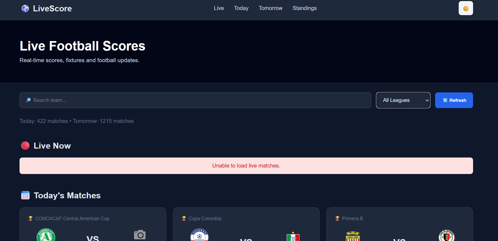

# ⚽ Live Sports Tracker

A real-time football tracking web application that displays live matches, upcoming fixtures, league standings, match events, and team information using live football data from API-Football.
## 📸 Preview


## 🌐 Live Features

- 🔴 Real-time live football scores
- 📅 Today's matches
- 📅 Tomorrow's upcoming matches
- 🔎 Search matches by team name
- 🏆 Filter matches by league
- 📊 Real league standings
- ⚽ Match details and events
- 🔄 Manual and automatic score refresh
- 🌙 Dark mode
- 📱 Responsive design
- ⏳ Loading states
- ⚠️ Error handling

## 🛠️ Technologies Used

- HTML5
- CSS3
- JavaScript
- Node.js
- Express.js
- REST API
- API-Football

## 📡 API Integration

The application uses API-Football to retrieve real-time football data including:

- Live fixtures
- Upcoming fixtures
- Match scores
- Match status
- League information
- Team logos
- Match events
- League standings

The API key is securely stored using environment variables and is not included in the repository.

## 📂 Project Structure

```text
live-sports-tracker/
│
├── index.html
├── style.css
├── script.js
├── server.js
├── package.json
├── package-lock.json
├── .gitignore
└── README.md